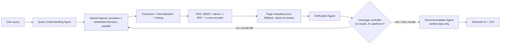

# 🛒 BuyWiseAI

Multi-agent, RAG-powered price comparison for **Pakistan** (+ AliExpress). Type a product; get **10+ verified results**
from different stores, each with price, source and a direct URL, plus an AI "best buy" summary.

- **LLM:** `openai/gpt-oss-120b` via the Groq API
- **Orchestration:** LangGraph (7 agents, with a coverage loop of up to 3 search rounds)
- **Search engines:** Serper (Google + Shopping), SerpAPI, Tavily, Brave, DuckDuckGo, optional AliExpress Affiliate API
- **RAG:** BM25 + `bge-small-en-v1.5` embeddings -> reciprocal rank fusion -> `ms-marco-MiniLM` cross-encoder
- **UI:** Streamlit

> **Honest limits.** No API searches "every" site. BuyWiseAI queries each whitelisted store (`config/platforms.yaml`)
> through search APIs (`site:` queries / `include_domains`) and never scrapes protected pages. Results depend on what the
> engines index; Daraz/OLX snippets often lack prices, so some listings get dropped (never guessed). If the target of
> 10 results from 6+ platforms isn't met, the app says so and shows what it found.

## Architecture


## Setup
```bash
python -m venv venv && source venv/bin/activate      # Windows: venv\Scripts\activate
pip install -r requirements.txt
cp .env.example .env                                 # then fill in keys
streamlit run app.py
```

| Variable | Needed? | Where to get it |
|---|---|---|
| `GROQ_API_KEY` | **Yes** | console.groq.com |
| `SERPER_API_KEY` | Recommended | serper.dev |
| `TAVILY_API_KEY`, `BRAVE_API_KEY`, `SERPAPI_API_KEY` | Optional | each provider's dashboard |
| `ALIEXPRESS_APP_KEY/SECRET/TRACKING_ID` | Optional | portals.aliexpress.com (approval takes days) |

DuckDuckGo works without a key. Each provider is used only if its key exists. One failing provider never crashes a search.

## Tests
```bash
pytest -q
```
Covers price parsing (PKR/USD formats), URL canonicalisation/dedup/product-page detection, the coverage controller,
accessory/outlier detection, RRF, and metadata parsing.

## Deploy
1. Push to GitHub (repo root must contain `app.py` and `requirements.txt`).
2. share.streamlit.io -> **New app** -> pick repo, branch `main`, file `app.py`.
3. **Advanced settings -> Secrets**, paste (see `.streamlit/secrets.toml.example`):
   ```toml
   GROQ_API_KEY = "..."
   SERPER_API_KEY = "..."
   ```
4. Deploy. If the app runs out of memory, turn off the reranker/dense toggles in the sidebar (BM25-only still works),
   or remove `sentence-transformers` from `requirements.txt`.

## Customising
- Add/remove stores: edit `config/platforms.yaml` (no code changes).
- Add a search engine: subclass `SearchProvider` in `buywise/providers/` and register it in `providers/__init__.py`.
- Tuning: too many accessories -> raise `rerank_threshold`; too few results -> raise `domains_per_round` or `max_rounds`,
  or lower `min_platforms` in the sidebar.

## Terms of service
Only official search APIs are used. Product pages are fetched only as a last resort, honouring `robots.txt`,
one request per second per domain, with an identifying User-Agent.
